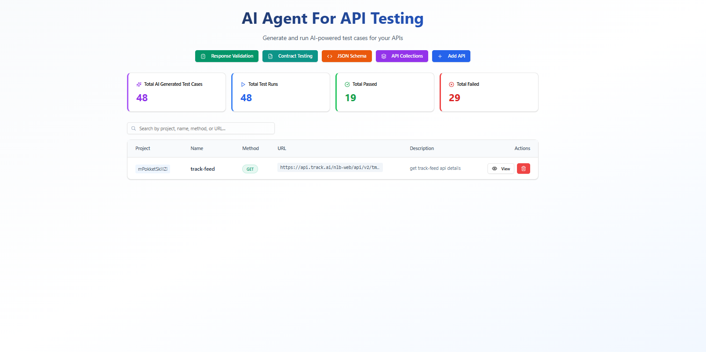
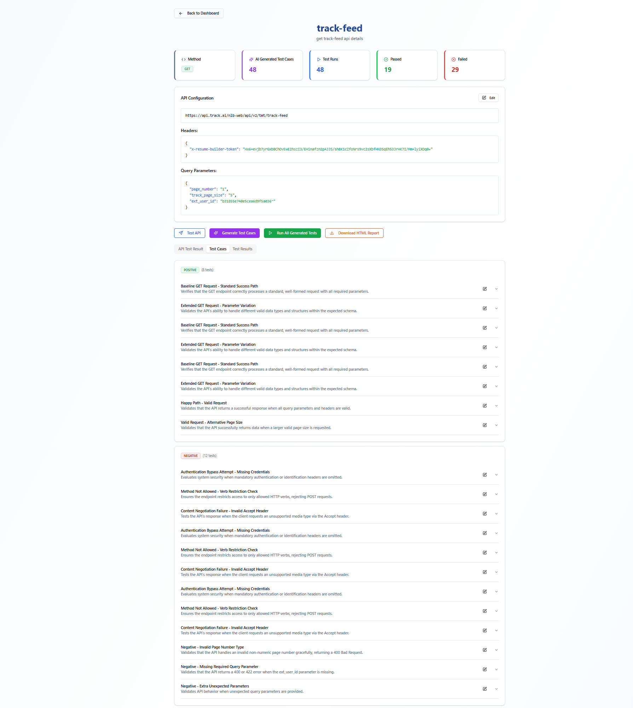
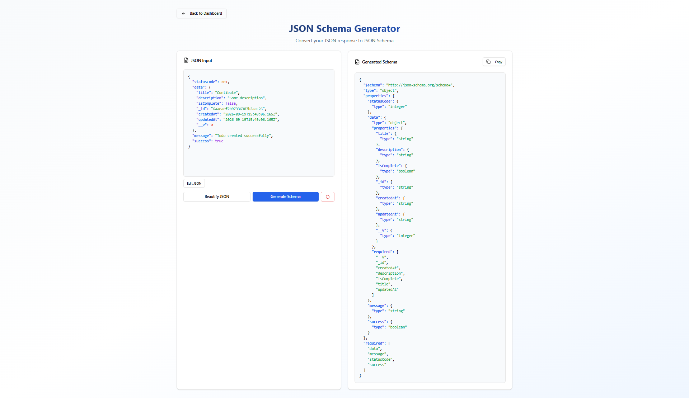
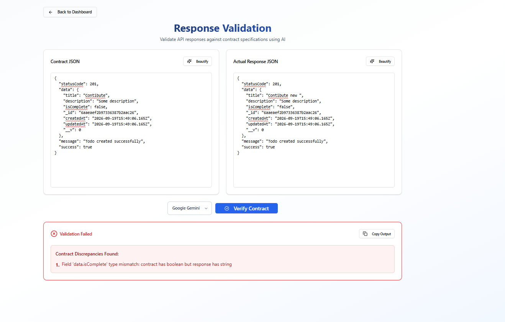

# 🤖 AI Agent for API Testing

> An intelligent, AI-powered API testing platform that automatically generates, executes, and validates test cases using OpenAI GPT-4 and Google Gemini — no manual test writing required.

---

## 🧠 AI Models Used

| AI Provider | Model | Purpose |
|---|---|---|
| **OpenAI** | `gpt-4-turbo-preview` / `gpt-4o-mini` | Test case generation & response contract validation |
| **Google Gemini** | `gemini-3.6-flash` | Alternative test case generation |
| **Local Engine** | Rule-based fallback | Offline test generation without API keys |

---

## 🛠️ Tech Stack

### Backend
- **Python 3.11+** — Core runtime
- **FastAPI** — REST API framework
- **aiosqlite** — Async SQLite database
- **OpenAI SDK** — GPT-4 integration
- **Google Generative AI SDK** — Gemini integration
- **Genson** — JSON Schema generation
- **Uvicorn** — ASGI server
- **Pydantic v2** — Data validation

### Frontend
- **React 18** — UI framework
- **React Router v6** — Client-side routing
- **Tailwind CSS** — Utility-first styling
- **shadcn/ui + Radix UI** — Component library
- **Axios** — HTTP client
- **Recharts** — Data visualization
- **Lucide React** — Icons
- **CRACO** — CRA config override

---

## ✨ Features

- **AI Test Generation** — Generate positive, negative, symmetric, and security test cases using GPT-4, Gemini, or local engine
- **cURL Import** — Paste any cURL command and auto-fill API configuration
- **Contract Testing** — Upload Swagger/OpenAPI specs, auto-parse endpoints, generate and execute contract tests
- **Response Validation** — Validate API responses against contracts using GPT-4 with detailed discrepancy reports
- **JSON Schema Generator** — Convert any JSON payload to a JSON Schema instantly
- **API Collections** — Group APIs, run them together, and track collection-level test history
- **Collection Variables** — Define reusable variables (headers, query params, body, URL) scoped to collections
- **HTML Report Download** — Export test results as styled HTML reports
- **Pagination & Search** — Search APIs by project, name, method, or URL with paginated results
- **Project Grouping** — Organize APIs under named projects

---

## 📁 Project Structure

```
App_Test_API/
├── backend/
│   ├── server.py                  # FastAPI app, all REST endpoints, DB init
│   ├── openai_generator.py        # GPT-4 test case generation
│   ├── gemini_generator.py        # Gemini test case generation
│   ├── fallback_test_engine.py    # Local rule-based test generation
│   ├── contract_ai_generator.py   # AI-powered contract test scenario generation
│   ├── contract_test_executor.py  # Contract test HTTP execution engine
│   ├── swagger_parser.py          # OpenAPI/Swagger file parser
│   ├── report_generator.py        # HTML report generator
│   ├── api_testing.db             # SQLite database (auto-created)
│   ├── app.log                    # Application logs
│   └── .env                       # Backend environment variables
├── frontend/
│   ├── public/
│   │   └── index.html
│   ├── src/
│   │   ├── pages/
│   │   │   ├── Dashboard.js           # API list, add/delete, stats
│   │   │   ├── APIDetail.js           # API detail, test generation & execution
│   │   │   ├── Collections.js         # Collection management
│   │   │   ├── CollectionDetail.js    # Collection run & results
│   │   │   ├── ContractTesting.js     # Swagger upload & contract tests
│   │   │   ├── ResponseValidation.js  # Contract vs response validator
│   │   │   └── JSONSchemaGenerator.js # JSON to Schema converter
│   │   ├── components/
│   │   │   ├── ui/                    # shadcn/ui components
│   │   │   └── CollectionVariables.jsx
│   │   ├── hooks/
│   │   ├── lib/
│   │   ├── App.js
│   │   └── index.js
│   ├── .env.development               # Dev environment config
│   ├── .env.production                # Prod environment config
│   ├── package.json
│   ├── tailwind.config.js
│   └── craco.config.js
├── requirements.txt
├── .gitignore
└── README.md
```

---

## 🚀 Setup & Run

### Prerequisites

- Python 3.11+
- Node.js 18+ and Yarn
- OpenAI API Key (optional — local engine available)
- Google Gemini API Key (optional)

---

### Backend Setup

**1. Navigate to the backend directory**
```bash
cd App_Test_API/backend
```

**2. Create and activate a virtual environment**
```bash
# Windows
python -m venv venv
venv\Scripts\activate

# macOS/Linux
python -m venv venv
source venv/bin/activate
```

**3. Install dependencies**
```bash
pip install -r ../requirements.txt
```

**4. Configure environment variables**

Create or edit `backend/.env`:
```env
CORS_ORIGINS="*"
OPENAI_API_KEY=your-openai-api-key-here
OPENAI_MODEL=gpt-4-turbo-preview
GEMINI_API_KEY=your-gemini-api-key-here
GEMINI_MODEL=gemini-3.6-flash
```

> **Note:** API keys are optional. You can use the **Local Engine** option for test generation without any keys.

**5. Start the backend server**
```bash
python server.py
OR
uvicorn server:app --host 0.0.0.0 --port 8000 --reload
```

The backend will start at: **http://localhost:8000**

API docs available at: **http://localhost:8000/docs**

---

### Frontend Setup

**1. Navigate to the frontend directory**
```bash
cd App_Test_API/frontend
```

**2. Install dependencies**
```bash
yarn install
```

**3. Configure environment variables**

Edit `frontend/.env.development`:
```env
REACT_APP_BACKEND_URL=http://localhost:8000
PORT=5000
```

**4. Start the frontend**
```bash
yarn start
```

The frontend will start at: **http://localhost:5000**

---

### Running Both Together

Open two terminals:

```bash
# Terminal 1 — Backend
cd App_Test_API/backend
python server.py

# Terminal 2 — Frontend
cd App_Test_API/frontend
yarn start
```

Then open **http://localhost:5000** in your browser.

---

## 📸 Screenshots

> Add screenshots of your application here. Recommended sections to capture:

| Page | Description |
|---|---|
| `Dashboard` | API list with stats cards (test cases, runs, passed, failed) |
| `API Detail` | Test generation panel with AI provider selection |
| `Contract Testing` | Swagger upload and endpoint parsing |
| `Response Validation` | Contract vs response comparison with AI analysis |
| `JSON Schema Generator` | JSON input and generated schema output |
| `Collections` | Collection list and run history |


<p align="center">
  
</p>

<p align="center">
  
</p>

<p align="center">
  
</p>

<p align="center">
  
</p>

---

## 🔌 API Endpoints Overview

| Method | Endpoint | Description |
|---|---|---|
| `POST` | `/api/apis` | Add a new API |
| `GET` | `/api/apis` | List all APIs (paginated, searchable) |
| `POST` | `/api/apis/{id}/test` | Test an API endpoint |
| `POST` | `/api/generate-testcases` | Generate AI test cases |
| `POST` | `/api/run-tests` | Execute test cases |
| `GET` | `/api/apis/{id}/report/download` | Download HTML test report |
| `POST` | `/api/parse-curl` | Parse a cURL command |
| `POST` | `/api/contract-tests/upload` | Upload Swagger file |
| `POST` | `/api/contract-tests/{id}/parse` | Parse Swagger endpoints |
| `POST` | `/api/contract-tests/{id}/generate-requests` | Generate contract test cases |
| `POST` | `/api/contract-tests/{id}/execute` | Execute contract tests |
| `POST` | `/api/validate-response` | Validate response against contract |
| `POST` | `/api/json-to-schema` | Convert JSON to JSON Schema |
| `GET` | `/api/collections` | List all collections |
| `POST` | `/api/collections/{id}/run` | Run all tests in a collection |

---

## 🌐 Production Deployment

**Build the frontend:**
```bash
cd frontend
yarn build
serve -s build -l 5000
```

Update `frontend/.env.production` with your production API URL:
```env
REACT_APP_BACKEND_URL=https://your-api-domain.com
```

---

